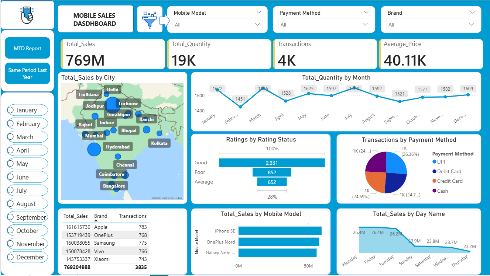
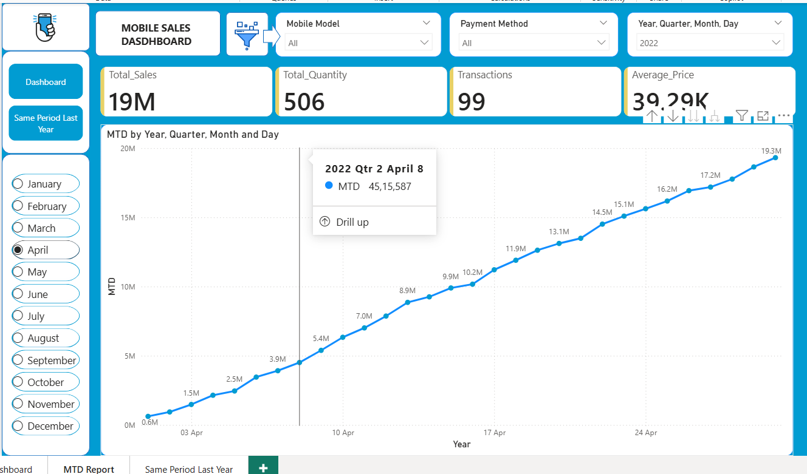
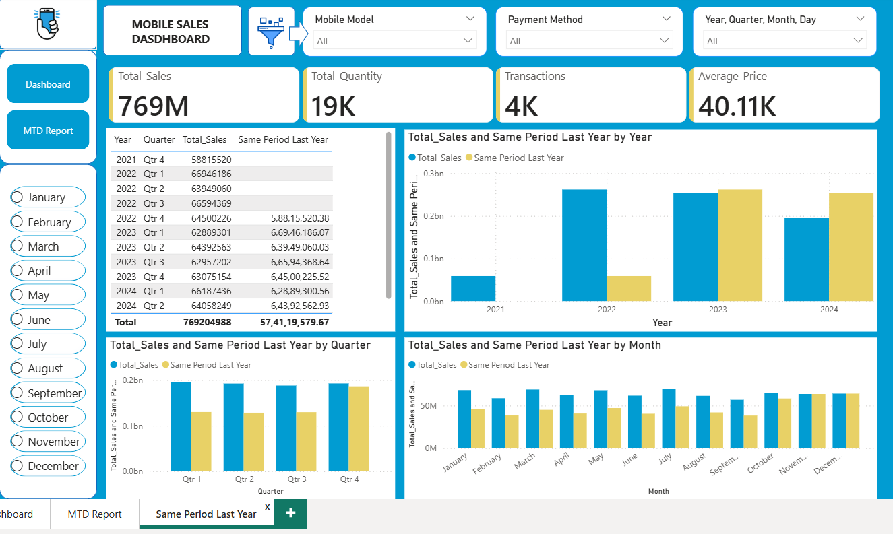

#  Mobile Sales Performance Dashboard (Power BI)

##  Project Overview

This project presents an interactive **Mobile Sales Performance Dashboard** built using Power BI to analyze and monitor sales data across multiple dimensions.

The dashboard helps stakeholders track performance, identify trends, and make data-driven decisions using advanced analytics like **Year-over-Year (YoY)** and **Month-to-Date (MTD)** comparisons.

---

##  Dashboard Preview

### 🔹 Executive Dashboard

### 🔹 MTD (Month-to-Date) Analysis

### 🔹 Year-over-Year (YoY) Comparison

---

##  Business Problem

In a competitive mobile retail market, businesses struggle to answer key questions:

* Which products and brands are driving the most revenue?
* How do sales vary across cities and time periods?
* Are we improving compared to last year?
* What are customer preferences in payments and product ratings?

Without a centralized dashboard, decision-making becomes slow and inefficient.

---

##  Solution

This dashboard transforms raw sales data into actionable insights by providing:

* Real-time performance tracking through KPIs
* Advanced time-based analysis (MTD & YoY)
* Product, regional, and customer-level insights
* Interactive filtering for dynamic exploration

---

##  Key Objectives

* Monitor overall sales performance
* Analyze trends using time intelligence
* Identify top-performing cities, brands, and models
* Understand customer behavior and preferences
* Enable interactive and user-friendly reporting

---

##  Key Metrics (KPIs)

*  **Total Sales:** 769M
*  **Total Quantity Sold:** 19K
*  **Total Transactions:** 4K
*  **Average Price:** 40.11K

---

##  Dashboard Features

###  Time Intelligence Analysis

* Year-wise Sales Comparison
* Same Period Last Year (YoY)
* Month-to-Date (MTD) Trend

---

###  Sales & Product Insights

* Top Selling Mobile Models
* Brand-wise Performance
* Monthly & Quarterly Sales Trends

---

###  Geographic Analysis

* City-wise Sales Distribution using Map Visualization

---

###  Customer Behavior Analysis

* Ratings Breakdown (Good, Average, Poor)
* Payment Method Analysis (UPI, Credit Card, Debit Card, Cash)

---

###  Interactive Filters

* Mobile Model
* Brand
* Payment Method
* Year / Quarter / Month / Day
* Month Selector

---

##  Key Business Insights

* A few cities contribute a major share of total sales
* Certain months show consistent peak performance (seasonality)
* Top mobile models dominate revenue contribution
* Customer ratings indicate generally positive satisfaction
* Digital payment methods are widely adopted

---

##  Tools & Technologies

* **Power BI** – Data Visualization
* **DAX** – Data Modeling & Calculations
* **Excel** – Data Source

---

##  Report Pages

1. **Executive Dashboard**
2. **MTD Report (Month-to-Date Analysis)**
3. **Same Period Last Year (YoY Analysis)**

---

##  Business Impact

This dashboard enables:

* Faster and data-driven decision-making
* Identification of high-performing products and regions
* Improved sales strategy planning
* Better understanding of customer behavior

---

##  Future Enhancements

* Profit and cost analysis (margin tracking)
* Customer segmentation (age group, repeat buyers)
* Predictive sales forecasting
* Drill-through and tooltip enhancements

---

##  Author

**Priyanka Chaudhary**
 Data Analyst | Power BI Developer

---
